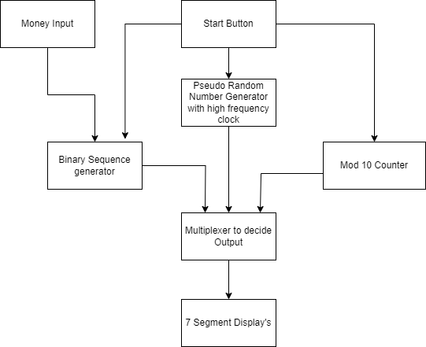

# Casino slot machine

<!-- First Section -->
## Team Details

  
Detail

  > Semester: 3rd Sem B. Tech. CSE

  > Section: S2

  > Team ID: 19

  > Member-1: Rudransh Kumar Ankodia, 231CS249, rudransh.231CS249@nitk.edu.in

  > member-2: Mohnish Hemanth Kumar, 231CS235, mhk.231CS235@nitk.edu.in

  > Member-3: Aman Kumar Singh, 231CS206, amankumarsingh.231cs206@nitk.edu.in

<!-- Second Section -->
## Abstract

  
Detail

       
1. Motivation: The reason we chose the casino slot machine project is because it allows us
       to apply our knowledge of digital electronics to a fun and popular concept. We can turn our
       theoretical knowledge into an interactive game by using flip-flops and logic gates in a real-world
       system like a slot machine. Figuring out how to simulate randomness and design the reward
       system within the limitations of the hardware is a challenging task.

       
2. Problem Statement: This project aims to design and build a functional casino slot machine
       using only flip-flops, logic gates, and other essential digital components. The machine should
       replicate the critical aspects of a real slot machine, including random outcomes, user interac
        tion, and reward calculations. We aim to implement the slot machine’s control system and
        output display entirely through hardware without relying on software or microcontrollers.

       
3. Features:
       
(a) Pseudo Random Number Generator using D-flipflops.

       
(b) Player Engagement Mechanism using Counters and Registers.

       
(c) Reward Distribution Logic.

       
(d) Spin Duration Control using logic gates.

## Functional Block Diagram

  
Detail

  
  

<!-- Third Section -->
## Working

  
Detail

  > Explain how your model works with the help of a functional table (compulsory) followed by the flowchart.

<!-- Fourth Section -->
## Logisim Circuit Diagram

  
Detail

  > Update a neat logisim circuit diagram

<!-- Fifth Section -->
## Verilog Code

  
Detail

  > Neatly update the Verilog code in code style only.

## References

  
Detail

  
> BBC News. *India train crash: At least 275 dead in Odisha, 2023*. Accessed: 2024-09-30.  
   [(https://www.bbc.com/news)](https://www.bbc.com/news/world-asia-india-65793257)
   

