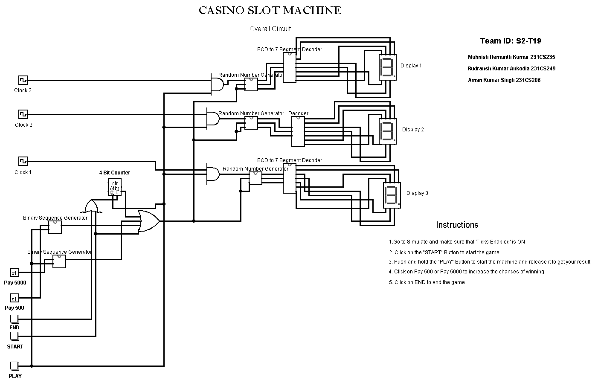

# Casino slot machine

<!-- First Section -->
## Team Details

  
Detail

  > Semester: 3rd Sem B. Tech. CSE

  > Section: S2

  > Team ID: 19

  > Member-1: Rudransh Kumar Ankodia, 231CS249, rudransh.231CS249@nitk.edu.in

  > member-2: Mohnish Hemanth Kumar, 231CS235, mhk.231CS235@nitk.edu.in

  > Member-3: Aman Kumar Singh, 231CS206, amankumarsingh.231cs206@nitk.edu.in

<!-- Second Section -->
## Abstract

  
Detail

       
1. Motivation: The reason we chose the casino slot machine project is because it allows us
       to apply our knowledge of digital electronics to a fun and popular concept. We can turn our
       theoretical knowledge into an interactive game by using flip-flops and logic gates in a real-world
       system like a slot machine. Figuring out how to simulate randomness and design the reward
       system within the limitations of the hardware is a challenging task.

       
2. Problem Statement: This project aims to design and build a functional casino slot machine
       using only flip-flops, logic gates, and other essential digital components. The machine should
       replicate the critical aspects of a real slot machine, including random outcomes, user interac
        tion, and reward calculations. We aim to implement the slot machine’s control system and
        output display entirely through hardware without relying on software or microcontrollers.

       
3. Features:
       
(a) Pseudo Random Number Generator using D-flipflops.

       
(b) Player Engagement Mechanism using Counters and Registers.

       
(c) Reward Distribution Logic.

       
(d) Spin Duration Control using logic gates.

## Functional Block Diagram

  
Detail

  
  

<!-- Third Section -->
## Working

  
Detail

  <h1> How does it work?</h1>
  Our Casino Slot Machine has 3 Seven Segment display's which display the Slot numbers. We use BCD to 7 segment display decoder to display the numbers.The numbers on the display are generated by LFSR(Linear Feedback Shift Registers) which generate Pseudo Random Numbers. Each of the the Random Number Generator is connected to clocks of different frequencies which help in preserving the randomness of the displayed numbers.To make sure the player Engages with the machine we have made sure that the player wins atleast ones in every 16 trials using a 4 bit counter. The machine also generates Binary Sequences based on the players input. If the player pay's 500rs it generates a sequence 1001 which repeats untill the user stops paying that amount. Whenever the user gets 1 in the sequence 7 7 7 is forced to be  displayed in the Random Number Generator. Similary we have a sequence 01001 if the user pays 5000rs. The Machine has a RESET button which resets the counter.The machine has a START button which is the main button to start each trial.The numbers keep on changing untill we hold the start button and stops when we release it.
  <h1>How does the game work?</h1>
  The Slot Machine has a minimum price of 50rs to play each trial. We start by holding the start button and releasing it after a while. If you manage to get the same number on all the three displays you will win 250rs. If you want to increase your chances of winning then you can increase the pay to either 500 of 5000 or both(5500) by turning the respective button On. If you press any of these buttons and manage to win then you will recieve either 1000rs , 10000rs or 11000 based on your input. To end the game and collect your money click on the RESET button.

<!-- Fourth Section -->
## Logisim Circuit Diagram

  
Detail

  

<!-- Fifth Section -->
## Verilog Code
## Verilog Code

  
Detail

  <code>
      
    module LFSR_3bit (input clk,input reset,input enable,input [2:0] seed,output reg [2:0] random_num);
    reg [2:0] lfsr;
    always @(posedge clk or posedge reset) begin
        if (reset) begin
            lfsr <= seed; 
        end else if (enable) begin
            lfsr <= {lfsr[1:0], lfsr[2] ^ lfsr[0]};
        end
    end
    always @(*) begin
        random_num = lfsr;
      
      end
     endmodule
     
     module rng_system_gate (input clk,input reset,input button_press,output reg [2:0] rng1,output reg [2:0] rng2,output reg [2:0] rng3);
    wire clk_enable = button_press;
    wire [2:0] seed1 = 3'b101;
    wire [2:0] seed2 = 3'b110;
    wire [2:0] seed3 = 3'b111;
    reg [3:0] trial_count;
    wire [2:0] rng1_wire;
    wire [2:0] rng2_wire;         
    wire [2:0] rng3_wire;        
    LFSR_3bit_gate rng_inst1 (.clk(clk), .reset(reset), .enable(clk_enable), .seed(seed1), .random_num(rng1_wire));
    LFSR_3bit_gate rng_inst2 (.clk(clk), .reset(reset), .enable(clk_enable), .seed(seed2), .random_num(rng2_wire));
    LFSR_3bit_gate rng_inst3 (.clk(clk), .reset(reset), .enable(clk_enable), .seed(seed3), .random_num(rng3_wire));

    always @(posedge clk or posedge reset) begin
        if (reset) begin
            trial_count <= 4'd0;
            rng1 <= 3'd0;
            rng2 <= 3'd0;
            rng3 <= 3'd0;
        end
        else if (clk_enable) begin
            if (trial_count == 4'd15) begin
                rng1 <= 3'd7;
                rng2 <= 3'd7;
                rng3 <= 3'd7;
                trial_count <= 4'd0;
            end else begin
                rng1 <= rng1_wire;
                rng2 <= rng2_wire;
                rng3 <= rng3_wire;
                trial_count <= trial_count + 4'd1;
            end
        end
    end
    endmodule

    module rng_system (input clk,input reset,input button_press,output reg [2:0] rng1,output reg [2:0] rng2,output reg [2:0] rng3);
    wire clk_enable = button_press;
    wire [2:0] seed1 = 3'b101;
    wire [2:0] seed2 = 3'b110;
    wire [2:0] seed3 = 3'b111;
    reg [3:0] trial_count;
    wire [2:0] rng1_wire;
    wire [2:0] rng2_wire;
    wire [2:0] rng3_wire;
    LFSR_3bit rng_inst1 (.clk(clk),.reset(reset),.enable(clk_enable),.seed(seed1),.random_num(rng1_wire));
    LFSR_3bit rng_inst2 (.clk(clk),.reset(reset),.enable(clk_enable),.seed(seed2),.random_num(rng2_wire));
    LFSR_3bit rng_inst3 (.clk(clk),.reset(reset),.enable(clk_enable),.seed(seed3),.random_num(rng3_wire));
    always @(posedge clk or posedge reset) begin
        if (reset) begin
            trial_count <= 4'd0;
            rng1 <= 3'd0;
            rng2 <= 3'd0;
            rng3 <= 3'd0;
        end
        else if (clk_enable) begin
            if (trial_count == 4'd15 ) begin  
                rng1 <= 3'd7;
                rng2 <= 3'd7;
                rng3 <= 3'd7;
                trial_count <= 4'd0; 
            end else begin
                rng1 <= rng1_wire;
                rng2 <= rng2_wire;
                rng3 <= rng3_wire;
                trial_count <= trial_count + 4'd1;
            end
        end
    end

    endmodule
    module DFF (
    input D, input clk, input reset, output reg Q);
    always @(posedge clk or posedge reset) begin
        if (reset) 
            Q <= 1'b0;
        else
            Q <= D;
    end
    endmodule

    module XOR2 (
    input A, input B, output Y
       );
    assign Y = A ^ B;
    endmodule

    module LFSR_3bit_gate (input clk, input reset, input enable, input [2:0] seed, output reg [2:0] random_num);
    reg [2:0] lfsr;
    wire feedback;
    assign feedback = lfsr[2] ^ lfsr[0];
    always @(posedge clk or posedge reset) begin
        if (reset) begin
            lfsr <= seed;
        end else if (enable) begin
            lfsr <= {lfsr[1:0], feedback};
        end
    end
    always @(*) begin
        random_num = lfsr;
    end
    endmodule
  </code>

---
### Test bench File
<code>
  `timescale 1ns / 1ps
`include "slot.v"
module tb_rng_system;
    reg clk;
    reg reset;
    reg button_press;
    wire [2:0] rng1_wire_normal;
    wire [2:0] rng2_wire_normal;
    wire [2:0] rng3_wire_normal;
    wire [2:0] rng1_wire_gate;
    wire [2:0] rng2_wire_gate;
    wire [2:0] rng3_wire_gate;
    reg [0:24] trial_money;  
    reg [0:24] trial_money2;
    reg [2:0] temp_rng1_normal;
    reg [2:0] temp_rng2_normal;
    reg [2:0] temp_rng3_normal;
    reg [2:0] temp_rng1_gate;
    reg [2:0] temp_rng2_gate;
    reg [2:0] temp_rng3_gate;
    integer i;
    integer count_500;
    rng_system normal_system (.clk(clk),.reset(reset),.button_press(button_press),.rng1(rng1_wire_normal),.rng2(rng2_wire_normal),.rng3(rng3_wire_normal));
    rng_system_gate gate_system (.clk(clk),.reset(reset),.button_press(button_press),.rng1(rng1_wire_gate),.rng2(rng2_wire_gate),.rng3(rng3_wire_gate));
    always #5 clk = ~clk;
    initial begin
        clk = 0;
        reset = 0;
        button_press = 0;
        reset = 1;
        #10;
        reset = 0;
        i = 0;
        count_500 = 0;
        $display("\t  Trial\t  Behavioral Level\t  Gate Level\t\tMoney");
        $display("\t\tRNG1\tRNG2\tRNG3\tRNG1\tRNG2\tRNG3");
        for (integer trial = 1; trial <= 24; trial = trial + 1) begin
            button_press = 1;
            #500;
            if (trial == 6 || trial == 9 || trial == 13 || trial == 15 || 
                trial == 18 || trial == 19 || trial == 22 || trial == 23) begin
                temp_rng1_normal = 3'b111; 
                temp_rng2_normal = 3'b111;  
                temp_rng3_normal = 3'b111;  
                temp_rng1_gate = 3'b111;    
                temp_rng2_gate = 3'b111;  
                temp_rng3_gate = 3'b111;   
            end else begin
                temp_rng1_normal = rng1_wire_normal;
                temp_rng2_normal = rng2_wire_normal;
                temp_rng3_normal = rng3_wire_normal;
                temp_rng1_gate = rng1_wire_gate;
                temp_rng2_gate = rng2_wire_gate;
                temp_rng3_gate = rng3_wire_gate;
                if (temp_rng1_normal == 3'b111) begin
                     temp_rng1_normal = 3'b101;
                     temp_rng2_normal = 3'b110;
                     temp_rng3_normal = 3'b001;
                     temp_rng1_gate = 3'b100;
                     temp_rng1_gate = 3'b011;
                     temp_rng1_gate = 3'b101;
                end
            end
            if (trial >= 5 && trial <= 13) begin
                trial_money[trial] = 1;
            end
            if (trial >= 15 && trial <= 24) begin
                trial_money2[trial] = 1;
            end
            if (trial_money[trial] == 1) begin
                $display("%d\t%d\t%d\t%d\t%d\t%d\t%d\t5000", trial, temp_rng1_normal, temp_rng2_normal, temp_rng3_normal, temp_rng1_gate, temp_rng2_gate, temp_rng3_gate);
            end 
            else if (trial_money2[trial] == 1) begin
                $display("%d\t%d\t%d\t%d\t%d\t%d\t%d\t500", trial, temp_rng1_normal, temp_rng2_normal, temp_rng3_normal, temp_rng1_gate, temp_rng2_gate, temp_rng3_gate);
            end
            else begin
                $display("%d\t%d\t%d\t%d\t%d\t%d\t%d\t50", trial, temp_rng1_normal, temp_rng2_normal, temp_rng3_normal, temp_rng1_gate, temp_rng2_gate, temp_rng3_gate);
            end
            button_press = 0;
            #100; 
        end
        $display("Simulation complete.");
        $finish;
    end
endmodule

</code>

 

## References

  
Detail

  
 1. https://www.analog.com/en/resources/design-notes/random-number-generation-using-lfsr
 2. https://electronics.stackexchange.com/questions/229590/logic-gates-creating-a-digital-counter
 3. https://stackoverflow.com/questions/4137927/slot-machine-payout-calculation
   

